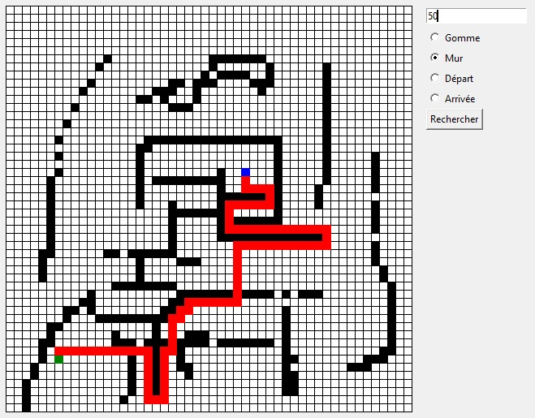

# Python-Pathfinding-Algorithme

This is a test of a pathfinding algorithme.
## Features
- Map creator
## Installation
1. Download the repository by clicking on `Code > Download ZIP`
2. Extract the ZIP file
3. Run `main.pyw`
## Requirements
- Python 3.7
- Python tkinter library
- Python time library
## Usage
You can create a map by adding walls and the start and end points of the path, and then click on `Rechercher`.